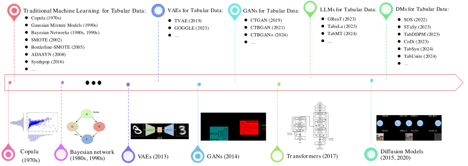

# [Awesome Diffusion Models For Tabular Data](https://arxiv.org/)

[](https://github.com/Diffusion-Model-Leiden/awesome-diffusion-models-for-tabular-data) [](https://creativecommons.org/licenses/by/4.0/) [](https://visitorbadge.io/status?path=Diffusion-Model-Leiden%2Fawesome-diffusion-models-for-tabular-data) 

## Diffusion Models for Tabular Data

We explore recent advancements in **diffusion models for tabular data** and highlight key challenges, current progress, and future directions.

📖 **You are welcome to read our paper and share your feedback!**  
👉 [Diffusion Models for Tabular Data: Challenges, Current Progress, and Future Directions (under review)](https://arxiv.org/abs/2502.17119)

### ⭐ Support & Citation  
If you find our survey and this repository helpful, please **star this project** and cite our paper:

```bibtex
@misc{liDiffusion2025,
  title = {Diffusion Models for Tabular Data: Challenges, Current Progress, and Future Directions},
  author = {Zhong Li, Qi Huang*, Lincen Yang*, Jiayang Shi, Zhao Yang, Niki van Stein, Thomas Bäck, Matthijs van Leeuwen},
  year = {2025},
  month = {February},
  primaryclass = {cs},
  doi = {}
}
```

### 🤝 Suggest Papers
Thank you for your interest in contributing to this list! 🎉 <br>
We appreciate any efforts to recommend papers, please ensure that:
- Their topics are closely related to **diffusion models for tabular data**.
- The papers focus on methodology.
- No **duplicate** entries exist.
- The papers are **high-quality and well-written**.

📝 To suggest a new paper, please open a **new issue** and use the [template](https://github.com/Diffusion-Model-Leiden/awesome-diffusion-models-for-tabular-data/blob/main/.github/ISSUE_TEMPLATE/paper-suggestion.md).

💡 **Tip:** Check the [existing issues](https://github.com/Diffusion-Model-Leiden/awesome-diffusion-models-for-tabular-data/issues) to avoid duplicates before submitting.

---
# Table of Contents

- [Awesome Diffusion Models For Tabular Data](#awesome-diffusion-models-for-tabular-data)
  - [Diffusion Models for Tabular Data](#diffusion-models-for-tabular-data)
    - [⭐ Support \& Citation](#-support--citation)
    - [🤝 Suggest Papers](#-suggest-papers)
- [Table of Contents](#table-of-contents)
- [Timeline of GenAI for Tabular Data](#timeline-of-genai-for-tabular-data)
- [Taxonomy of Diffusion Models for Tabular Data](#taxonomy-of-diffusion-models-for-tabular-data)
- [Data Augmentation](#data-augmentation)
  - [Single Table Synthesis](#single-table-synthesis)
  - [Multi-relational Data Synthesis](#multi-relational-data-synthesis)
- [Data Imputation](#data-imputation)
- [Trustworthy Data Synthesis](#trustworthy-data-synthesis)
- [Anomaly Detection](#anomaly-detection)
- [(In Depth) Handling Discrete Data in Diffusion Models](#in-depth-handling-discrete-data-in-diffusion-models)
- [Collection of Datasets](#collection-of-datasets)
  - [Diffusion Model Usage Across Benchmarking Datasets](#diffusion-model-usage-across-benchmarking-datasets)
  - [Benchmarking Datasets for Various Diffusion Models](#benchmarking-datasets-for-various-diffusion-models)

# Timeline of GenAI for Tabular Data


# Taxonomy of Diffusion Models for Tabular Data

Research on generative models for tabular data is primarily motivated by real-world applications. Based on their usage, we classify existing studies into four main categories:

- [**Data Augmentation**](#data-augmentation): Artificially generate **new tables or entries** from existing datasets.  
  - Commonly used to **address class imbalance** in classification tasks.  
  - Enhances the **robustness and performance** of machine learning models.

- [**Data Imputation**](#data-imputation): Fill in **missing or incomplete entries** within existing tables.

- [**Trustworthy Data Synthesis**](#trustworthy-data-synthesis): Generate entirely new synthetic tables or entries while preserving **privacy, fairness, and statistical integrity**.  
  - Ensures **privacy protection** by preventing data exposure and leakage.  
  - Produces **representative** samples without amplifying biases in the original dataset.

- [**Anomaly Detection**](#anomaly-detection): Identify **unusual, rare, or suspicious entries** that deviate significantly from normal patterns in the data.


# Data Augmentation

The topic of data augmentation can be divided into two sub-topics: single table synthesis and multi-relational data synthesis.

## Single Table Synthesis

Single table synthesis: generation of an entire table or a specific part of a table (over sampling)

|  Abbr.  |   Title  |   Venue & Year |   Code   |   Domain   |
|:--------|:--------:|:--------:|:--------:|:--------:|
SOS | [**Sos: Score-based oversampling for tabular data**](https://arxiv.org/abs/2206.08555) | KDD 2022 | [](https://github.com/jayoungkim408/sos) | Generic|
STaSy | [**STaSy: Score-based Tabular data Synthesis**](https://arxiv.org/abs/2210.04018) | ICLR 2023 | [](https://github.com/JayoungKim408/STaSy) | Generic |
TabDDPM | [**Tabddpm: Modelling tabular data with diffusion models**](https://arxiv.org/abs/2209.15421) | ICML 2023 | [](https://github.com/yandex-research/tab-ddpm) | Generic |
CoDi | [**Codi: Co-evolving contrastive diffusion models for mixed-type tabular synthesis**](https://arxiv.org/abs/2304.12654) | ICML 2023 | [](https://github.com/chaejeonglee/codi) | Generic |
MissDiff | [**MissDiff: Training Diffusion Models on Tabular Data with Missing Values**](https://arxiv.org/abs/2307.00467) | ICML Workshop 2023 | N/A | Generic |
AutoDiff | [**AutoDiff: combining Auto-encoder and Diffusion model for tabular data synthesizing**](https://arxiv.org/abs/2310.15479) | NeurIPS Workshop 2023 | [](https://github.com/ucla-trustworthy-ai-lab/autodiffusion) | Generic |
DPM-EHR | [**Synthetic health-related longitudinal data with mixed-type variables generated using diffusion models**](https://arxiv.org/abs/2303.12281) | NeurIPS Workshop 2023 | [Promise to release](https://healthgym.ai/) | Healthcare |
FinDiff | [**Findiff: Diffusion models for financial tabular data generation**](https://arxiv.org/abs/2309.01472) | ICAIF 2023 | [](https://github.com/sattarov/FinDiff) | Finance |
CDTD | [**Continuous Diffusion for Mixed-Type Tabular Data**](https://arxiv.org/abs/2312.10431v4) | ICLR 2025 | [](https://github.com/muellermarkus/cdtd) | Generic |
MedDiff | [**MedDiff: Generating electronic health records using accelerated denoising diffusion model**](https://arxiv.org/abs/2302.04355) | ArXiv 2023 | N/A | Healthcare |
EHR-TabDDPM | [**Synthesizing mixed-type electronic health records using diffusion models**](https://arxiv.org/abs/2302.14679) | ArXiv 2023 | N/A | Healthcare |
TabSyn | [**Mixed-Type Tabular Data Synthesis with Score-based Diffusion in Latent Space**](https://arxiv.org/abs/2310.09656) | ICLR 2024 | [](https://github.com/amazon-science/tabsyn) | Generic |
FlexGen-EHR | [**A Flexible Generative Model for Heterogeneous Tabular EHR with Missing Modality**](https://openreview.net/forum?id=W2tCmRrj7H) | ICLR 2024 | N/A | Healthcare |
EHRDiff | [**EHRDiff: Exploring Realistic EHR Synthesis with Diffusion Models**](https://arxiv.org/abs/2303.05656) | TMLR 2024 | [](https://github.com/sczzz3/ehrdiff) | Healthcare |
Forest-Diffusion | [**Generating and imputing tabular data via diffusion and flow-based gradient-boosted trees**](https://arxiv.org/abs/2309.09968) | AISTATS 2024 | [](https://github.com/SamsungSAILMontreal/ForestDiffusion) | Generic |
TabDiff | [**TabDiff: a Unified Diffusion Model for Multi-Modal Tabular Data Generation**](https://arxiv.org/abs/2410.20626) | ICLR 2025 | [](https://github.com/MinkaiXu/TabDiff) | Generic |
EntTabDiff | [**Entity-based Financial Tabular Data Synthesis with Diffusion Models**](https://doi.org/10.1145/3677052.3698625) | ICAIF 2024 | N/A | Finance |
Imb-FinDiff | [**Imb-FinDiff: Conditional Diffusion Models for Class Imbalance Synthesis of Financial Tabular Data**](https://doi.org/10.1145/3677052.3698659) | ICAIF 2024 | N/A | Finance |
EHR-D3PM | [**Guided discrete diffusion for electronic health record generation**](https://arxiv.org/abs/2404.12314) | ArXiv 2024 | N/A | Healthcare |
TabUnite | [**TabUnite: Efficient Encoding Schemes for Flow and Diffusion Tabular Generative Models**](https://openreview.net/forum?id=Zoli4UAQVZ) | OpenReview 2024 | [](https://github.com/jacobyhsi/TabUnite) | Generic |
FraudDiffuse | [**FraudDiffuse: Diffusion-aided Synthetic Fraud Augmentation for Improved Fraud Detection**](https://doi.org/10.1145/3677052.3698658) | ICAIF 2024 | N/A | Finance |
FraudDDPM | [**Synthetic Data Generation for Fraud Detection Using Diffusion Models**](https://doi.org/10.11610/isij.5534) | ISIJ 2024 | N/A | Finance |

## Multi-relational Data Synthesis

Multi-relational data synthesis: generation of multiple tables while considering their intercorrelations and constraints

|  Abbr.  |   Title  |   Venue & Year  |   Code   |   Domain   |
|:--------|:--------:|:--------:|:--------:|:--------:|
ClavaDDPM | [**ClavaDDPM: Multi-relational Data Synthesis with Cluster-guided Diffusion Models**](https://arxiv.org/abs/2405.17724) | NeurIPS 2024 | [](https://github.com/weipang142857/clavaddpm) | Generic |
GNN-TabSyn | [**Relational Data Generation with Graph Neural Networks and Latent Diffusion Models**](https://openreview.net/forum?id=MNLR2NYN2Z#discussion) | NeurIPS Workshop 2024 | [](https://github.com/ValterH/relational-graph-conditioned-diffusion) | Generic |

# Data Imputation

Data imputation involves generating plausible values to fill in missing entries in tabular data

|  Abbr.  |   Title  |   Venue & Year  |   Code   |   Domain   |
|:--------|:--------:|:--------:|:--------:|:--------:|
TabCSDI | [**Diffusion models for missing value imputation in tabular data**](https://arxiv.org/abs/2210.17128) | NeurIPS Workshop 2022 | [](https://github.com/pfnet-research/CSDI_T) | Generic |
TabDiff | [**TabDiff: a Unified Diffusion Model for Multi-Modal Tabular Data Generation**](https://arxiv.org/abs/2410.20626) | ICLR 2025 |  [](https://github.com/MinkaiXu/TabDiff)| Generic |
SimpDM | [**Self-supervision improves diffusion models for tabular data imputation**](https://arxiv.org/abs/2407.18013) | CIKM 2024 | [](https://github.com/yixinliu233/simpdm) | Generic |
MTabGen | [**Diffusion models for tabular data imputation and synthetic data generation**](https://arxiv.org/abs/2407.02549) | ArXiv 2024 | Promise to release upon acceptance| Generic |
DDPM-Perlin | [**Natural generative noise diffusion model imputation**](https://doi.org/10.1016/j.knosys.2024.112310) | KBS 2024 | [Empty repository](https://github.com/arizbw/perlin-diffusion-imputation) | Generic |
NewImp | [**Rethinking the diffusion models for missing data imputation: A gradient flow perspective**](https://proceedings.neurips.cc/paper_files/paper/2024/hash/cb1ba6a42814bf83974ed45ffdb72efa-Abstract-Conference.html) | NeurIPS 2024 | [](https://github.com/JustusvLiebig/NewImp) | Generic |
DiffPuter | [**Unleashing the Potential of Diffusion Models for Incomplete Data Imputation**](https://arxiv.org/abs/2405.20690) | OpenReview 2024 | [](https://github.com/hengruizhang98/DiffPuter) | Generic |
TabSyn | [**Mixed-Type Tabular Data Synthesis with Score-based Diffusion in Latent Space**](https://arxiv.org/abs/2310.09656) | ICLR 2024 | [](https://github.com/amazon-science/tabsyn) | Generic |
Forest-Diffusion | [**Generating and imputing tabular data via diffusion and flow-based gradient-boosted trees**](https://arxiv.org/abs/2309.09968) | AISTATS 2024 | [](https://github.com/SamsungSAILMontreal/ForestDiffusion) | Generic |

# Trustworthy Data Synthesis

Trustworthy data synthesis aims to generate realistic surrogate values for sensitive entries while keeping the overall utility of the tabular data.

|  Abbr.  |   Title  |   Venue & Year  |   Code   |   Domain   |
|:--------|:--------:|:--------:|:--------:|:--------:|
SiloFuse | [**SiloFuse: Cross-silo Synthetic Data Generation with Latent Tabular Diffusion Models**](https://arxiv.org/abs/2404.03299) | ICDE 2024 | N/A | Generic |
FedTabDiff | [**FedTabDiff: Federated Learning of Diffusion Probabilistic Models for Synthetic Mixed-Type Tabular Data Generation**](https://arxiv.org/abs/2401.06263) | ArXiv 2024 | [](https://github.com/sattarov/fedtabdiff) | Generic |
FairTabDDPM | [**Balanced Mixed-Type Tabular Data Synthesis with Diffusion Models**](https://arxiv.org/abs/2404.08254) | ArXiv 2024 | [](https://github.com/comp-well-org/fair-tab-diffusion) | Generic |
DP-Fed-FinDiff | [**Differentially Private Federated Learning of Diffusion Models for Synthetic Tabular Data Generation**](https://arxiv.org/abs/2412.16083) | ArXiv 2024 | N/A | Finance |

# Anomaly Detection

In anomaly detecion, diffusion models are used to learn the “normal” distribution of data from the known set and identify anomalies as deviations from this learned distribution in the unseen data.

|  Abbr.  |   Title  |   Venue & Year  |   Code   |   Domain   |
|:--------|:--------:|:--------:|:--------:|:--------:|
TabADM | [**TabADM: Unsupervised Tabular Anomaly Detection with Diffusion Models**](https://arxiv.org/abs/2307.12336) | ArXiv 2023 | N/A | Generic |
DTE | [**On Diffusion Modeling for Anomaly Detection**](https://arxiv.org/abs/2305.18593) | ICLR 2024 | [](https://github.com/vicliv/DTE) | Generic |
SDAD | [**Self-supervised enhanced denoising diffusion for anomaly detection**](https://doi.org/10.1016/j.ins.2024.120612) | Inf. Sci. 2024 | [Under construction](https://github.com/lsmiao1209/DOD_codes) | Generic |
NSCBAD | [**Anomaly Detection by Estimating Gradients of the Tabular Data Distribution**](https://openreview.net/forum?id=7QDIFrtAsB) | OpenReview 2024 | [Supplementary Material](https://openreview.net/forum?id=7QDIFrtAsB) | Generic |
FraudDiffuse | [**FraudDiffuse: Diffusion-aided Synthetic Fraud Augmentation for Improved Fraud Detection**](https://doi.org/10.1145/3677052.3698658) | ICAIF 2024 | N/A | Finance |
FraudDDPM | [**Synthetic Data Generation for Fraud Detection Using Diffusion Models**](https://doi.org/10.11610/isij.5534) | ISIJ 2024 | N/A | Finance |

# (In Depth) Handling Discrete Data in Diffusion Models

Diffusion models are primarily designed for continous values.

Tabular data often contains discrete values and structured information (e.g., country names or product categories).

To develop robust diffusion models for tabular data, it is crucial to design techniques that intrinsically accommodate discrete data.

Though discussed in our survey paper, we would like to forward the interesting readers to the repository built by 
Kuleshov Group of Cornell University:
- [Awesome Discrete Diffusion Models](https://github.com/kuleshov-group/awesome-discrete-diffusion-models)

# Collection of Datasets

Various datasets have been used to evaluate the performance of diffusion models for tabular data.
Most datasets come from the well-established UCI machine learning repository, OpenML collection, and Kaggle platform.

## Diffusion Model Usage Across Benchmarking Datasets
| Dataset Name | Appeared in |
|:--------|:--------:|
Satimage | SOS |
Shoppers | SOS, STaSy, AutoDiff, TabSyn, TabDiff, TabUnite, DiffPuter |
Surgical | SOS |
Buddy | SOS, TabDDPM |
Default | SOS, STaSy, TabDDPM, FinDiff, CDTD, TabSyn, TabDiff, TabUnite, DiffPuter, DP-Fed-FinDiff |
Weatheraus | SOS |
Credit | STaSy, DDPM-Perlin |
Htru | STaSy, AutoDiff |
Magic | STaSy, AutoDiff, TabSyn, TabDiff, TabUnite, DiffPuter |
Phishing | STaSy, CoDi |
Spambase | STaSy |
Bean | STaSy, AutoDiff, Forest-Diffusion, DiffPuter |
Contraceptive | STaSy |
Crowsource | STaSy |
Obesity | STaSy, CoDi, AutoDiff |
Robot | STaSy |
Shuttle | STaSy |
Beijing | STaSy, CDTD, TabSyn, TabDiff, TabUnite, DiffPuter |
News | STaSy, AutoDiff, CDTD, TabSyn, TabDiff, TabUnite, DiffPuter |
Abalone | TabDDPM, AutoDiff, SimpDM, SiloFuse |
Adult | TabDDPM, AutoDiff, CDTD, TabSyn, TabDiff, Imb-FinDiff, TabUnite, MTabGen, DiffPuter, SiloFuse, FairTabDDPM, DP-Fed-FinDiff |
California Housing | TabDDPM, Forest-Diffusion, MTabGen |
Cardio | TabDDPM, TabUnite, MTabGen, SiloFuse |
Churn | TabDDPM, AutoDiff, CDTD, MTabGen, SiloFuse |
Diabetes | TabDDPM, CDTD, TabDiff, TabCSDI, SimpDM, SiloFuse, FedTabDiff |
Facebook comm. vol. | TabDDPM |
Gesture | TabDDPM, DiffPuter |
Higgs small | TabDDPM |
House 16h | TabDDPM |
Insurance | TabDDPM, CoDi, AutoDiff, MTabGen |
King | TabDDPM |
Miniboone | TabDDPM |
Wilt | TabDDPM, AutoDiff |
Bank | CoDi, CDTD, TabUnite, FairTabDDPM |
Heart | CoDi |
Seismic | CoDi |
Stroke | CoDi, EHR-TabDDPM, TabUnite |
Cmc | CoDi |
Customer | CoDi |
Faults | CoDi, AutoDiff, TabDiff |
Car | CoDi, Forest-Diffusion, DDPM-Perlin |
Clave | CoDi |
Nursery | CoDi, AutoDiff, DDPM-Perlin |
Absent | CoDi |
Drug | CoDi |
Census | MissDiff, TabCSDI |
Mimic4ed | MissDiff |
Bayesian network (artificial) | MissDiff |
Indian liver patient | AutoDiff, EHR-TabDDPM |
Titanic | AutoDiff |
ART for HIV | DPM-EHR |
Acute Hypotension | DPM-EHR |
Philadelphia city payments | FinDiff, FedTabDiff |
Fund holding | FinDiff |
Acsincome | CDTD |
Covertype | CDTD |
Lending | CDTD |
Nmes | CDTD |
MIMIC-III | MedDiff, EHR-TabDDPM, FlexGen-EHR, EHRDiff, EHR-D3PM |
Patient treatment classification | MedDiff |
Pima indians diabetes | EHR-TabDDPM |
eICU | FlexGen-EHR |
CinC2012 | EHRDiff |
PTB-ECG | EHRDiff |
Airfoil | Forest-Diffusion, SimpDM |
Blood | Forest-Diffusion, SimpDM, NewImp |
Breast | Forest-Diffusion, TabCSDI, NewImp |
Climate | Forest-Diffusion |
Concrete compression | Forest-Diffusion, TabCSDI, SimpDM, NewImp |
Concrete slump | Forest-Diffusion |
Connectionist bench sonar | Forest-Diffusion |
Connectionist bench vowel | Forest-Diffusion, NewImp |
Ecoli | Forest-Diffusion |
Glass | Forest-Diffusion |
Ionosphere | Forest-Diffusion, NewImp |
Iris | Forest-Diffusion, SimpDM |
Libras | Forest-Diffusion, TabCSDI |
Parkinsons | Forest-Diffusion, NewImp |
Planning relax | Forest-Diffusion |
Qsar biodegradation | Forest-Diffusion, NewImp |
Seeds | Forest-Diffusion |
Wine | Forest-Diffusion, TabCSDI, DDPM-Perlin |
Wine quality red | Forest-Diffusion, SimpDM |
Wine quality white | Forest-Diffusion, SimpDM, NewImp |
Yacht | Forest-Diffusion, SimpDM |
Yeast | Forest-Diffusion, SimpDM |
Tic-tac-toe | Forest-Diffusion |
Congressional voting | Forest-Diffusion |
Brazil E-commerce | EntTabDiff |
13F Fund Holdings | EntTabDiff |
Yelp reviews | EntTabDiff |
Accounting entries | Imb-FinDiff |
Philadephia city payments | Imb-FinDiff, DP-Fed-FinDiff |
IEEE-CIS fraud detection | Imb-FinDiff, FraudDiffuse, FraudDDPM |
Census synthetic | TabUnite |
European credit card default | FraudDiffuse |
Credit card fraud detection | FraudDDPM |
Online retail | FraudDDPM |
E-commerce transaction | FraudDDPM |
California Multi-relational | ClavaDDPM |
Instacart 05 | ClavaDDPM |
Berka | ClavaDDPM |
Movie Lens | ClavaDDPM |
CCS | ClavaDDPM |
AirBnB | GNN-TabSyn |
Biodegradability | GNN-TabSyn |
CORA | GNN-TabSyn |
IMDB | GNN-TabSyn |
Rossmann | GNN-TabSyn |
Walmart | GNN-TabSyn |
COVID-19 | TabCSDI |
Housing | SimpDM |
Energy | SimpDM |
German | SimpDM |
Phoneme | SimpDM |
Power | SimpDM |
Ecommerce | SimpDM |
HELOC | MTabGen, SiloFuse |
Gas | MTabGen |
House Sales | MTabGen |
Otto group | MTabGen |
Forest Cover| MTabGen, SiloFuse|
Bike | DDPM-Perlin |
CPU | DDPM-Perlin |
Frog | DDPM-Perlin |
Satellite | DDPM-Perlin |
Letter | DDPM-Perlin, DiffPuter |
Turkiye | DDPM-Perlin |
Loan | SiloFuse |
Intrusion | SiloFuse |
COMPAS | FairTabDDPM |
Marketing data | DP-Fed-FinDiff |
Adbench | TabADM, DTE, SDAD, NSCBAD |

## Benchmarking Datasets for Various Diffusion Models
| Model Abbreviation | Datasets Names |
|:--------|:--------:|
SOS | Satimage, Shoppers, Surgical, Buddy, Default, Weatheraus |
AutoDiff | Shoppers, Htru, Magic, Bean, Obesity, News, Abalone, Adult, Churn, Insurance, Wilt, Faults, Nursery, Indian liver patient, Titanic |
TabSyn | Shoppers, Default, Magic, Beijing, News, Adult |
TabDiff | Shoppers, Default, Magic, Beijing, News, Adult, Diabetes, Faults |
TabUnite | Shoppers, Default, Magic, Beijing, News, Adult, Cardio, Bank, Stroke, Census synthetic |
DiffPuter | Shoppers, Default, Magic, Bean, Beijing, News, Adult, Gesture, California Housing, Letter |
TabDDPM | Abalone, Adult, Buddy, Default, California Housing, Cardio, Churn, Diabetes, Facebook Comm. Vol., Gesture, Higgs Small, House 16h, Insurance, King, MinibooNE, Wilt |
STaSy | Default, Credit, Htru, Magic, Phishing, Spambase, Shoppers, Bean, Contraceptive, Crowsource, Obesity, Robot, Shuttle, Beijing, News |
FinDiff | Default, Philadelphia city payments, Fund holding |
CDTD | Default, Beijing, News, Adult, Churn, Diabetes, Bank, Acsincome, Covertype, Lending, Nmes |
DP-Fed-FinDiff | Default, Philadephia city payments, Adult, Marketing data |
DDPM-Perlin | Credit, Car, Nursery, Wine, Bike, CPU, Frog, Satellite, Letter, Turkiye |
CoDi | Phishing, Obesity, Insurance, Bank, Heart, Seismic, Stroke, Cmc, Customer, Faults, Car, Clave, Nursery, Absent, Drug |
Forest-Diffusion | Bean, California Housing, Car, Airfoil, Blood, Breast, Climate, Concrete compression, Concrete slump, Connectionist bench sonar, Connectionist bench vowel, Ecoli, Glass, Ionosphere, Iris, Libras, Parkinsons, Planning relax, Qsar biodegradation, Seeds, Wine, Wine quality red, Wine quality white, Yacht, Yeast, Tic-tac-toe, Congressional voting |
SimpDM | Abalone, Diabetes, Airfoil, Blood, Concrete compression, Iris, Wine quality red, Wine quality white, Yacht, Yeast, Housing, Energy, German, Phoneme, Power, Ecommerce, California Housing |
SiloFuse | Abalone, Adult, Cardio, Churn, Diabetes, HELOC, Loan, Forest Cover, Intrusion |
Imb-FinDiff | Adult, Accounting entries, Philadephia city payments, IEEE-CIS fraud detection |
MTabGen | Adult, California Housing, Cardio, Churn, Insurance, HELOC, Gas, House Sales, Otto group, Forest Cover|
FairTabDDPM | Adult, Bank, COMPAS |
TabCSDI | Diabetes, Census, Breast, Concrete compression, Libras, Wine, COVID-19 |
FedTabDiff | Diabetes, Philadelphia city payments |
EHR-TabDDPM | Stroke, Indian liver patient, MIMIC-III, Pima indians diabetes |
MissDiff | Census, Mimic4ed, Bayesian network (artificial) |
DPM-EHR | ART for HIV, Acute Hypotension |
MedDiff | MIMIC-III, Patient treatment classification |
FlexGen-EHR | MIMIC-III, eICU |
EHRDiff | MIMIC-III, CinC2012, PTB-ECG |
EHR-D3PM | MIMIC-III, 2 private EHR datasets |
NewImp | Blood, Breast, Concrete compression, Connectionist bench vowel, Ionosphere, Parkinsons, Qsar biodegradation, Wine quality white |
EntTabDiff | Brazil E-commerce, 13F Fund Holdings, Yelp reviews |
FraudDiffuse | IEEE-CIS fraud detection, European credit card default |
FraudDDPM | IEEE-CIS fraud detection, Credit card fraud detection, Online retail, E-commerce transaction |
ClavaDDPM | California Multi-relational, Instacart 05, Berka, Movie Lens, CCS |
GNN-TabSyn | AirBnB, Biodegradability, CORA, IMDB, Rossmann, Walmart |
TabADM | Adbench |
DTE | Adbench |
SDAD | Adbench |
NSCBAD | Adbench, 15 additional datasets from icl + elki + ex-ae + odds |

<h1> License </h1>

This project is licensed under the **Creative Commons Attribution 4.0 International (CC BY 4.0)** license.
You are free to share and adapt the material as long as you give proper credit.

**Full license details:** [CC-BY 4.0 License](https://creativecommons.org/licenses/by/4.0/)
